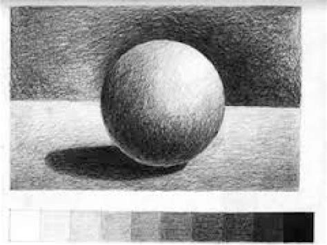

**Workshop Materials & Shading** 

Prof. Dr. Lena Gieseke | l.gieseke@filmuniversitaet.de | Film University Babelsberg *KONRAD WOLF*

Winter Term 21/22

---

Please go here: https://ctechfilmuniversity.github.io/workshop_matsha/

---

## Topics

* Intro to Shading
* Local Illumination
* Local Shading Models
* Implementation of p5's materials
* NPR Shading
* Rending Equation
* Scene rendering in a fragment shader
* Material interfaces

Please note that topics are still subject to change during the workshop!

## Learning Objectives

With this course, you will

* Understand what shading is
* Grasp core theoretical concepts of shading, lighting and rendering
* Be able to implement basic shading concept within a 3D engine
* Be able to go from there to explore creative shading options
* Understand modern shader development and the capabilities of fragment shaders
* Be able to implement modern fragment shaders in a creative context

## Grading

This workshop is part of the `Creative Technologies II` course and counts for 1 SWS and 1 ECTS. You can get more ECTS with additional project work. There is no grade for the workshop.

## Materials

* [`doc`](doc/): slides (to be added)
* [`code`](code/): code examples and project files
* [`exercise`](exercise): please upload your exercise result here, in a folder with your first name

---

🤩