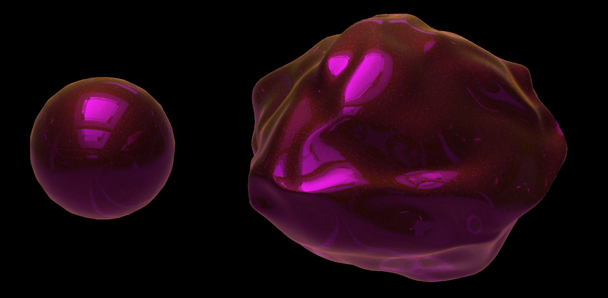

# Exercise 6

## Shading Interfaces

The theory, everything we have learned in this class is the same no matter the (software) environment. Usually the different shading interface do relate in one way or the other to the same principles. However, there are of course great differences in their implementation details.  

I leave it up to you to decide for which environment you want to investigate the shading interface in more details.  

Below, I offer the necessary information and tasks for Houdini. Even if you are not that crazy about using Houdini, it will refer to everything that we have learned so far nicely. It will be a good recap.
  
If you chose a different environment, you have to complete the following requirements for this exercise:

1. Investigation of the **main material(s)** of that environment (e.g. a physically based one?) and investigation of the materials' properties.
2. Investigation of **layering** different materials into one.
3. Investigation of **non-standard materials** and their properties.

Come up with a simple but nice scene including interesting shading effects. Submit at least one rendering of that scene.

If you are done with the MatSha topics and don't want to do this exercise, that is fine too. Then I will reduce your collected ECTS by 0.5.

------
## Upload

* Add your images to a file `matsha_ws2122_06_exercise_surname.md` (you can use a copy of [`matsha_ws2122_01_exercise_gieseke.md`](submissions/matsha_ws2122_01_exercise_gieseke.md))
* Upload that file to `/docs/exercise/submissions/`
* Link and upload your images to `/docs/exercise/submissions/img/`
* Please add the following header to your .md file at the top:

```
---
layout: default
title: Exercise
nav_exclude: true
---
```

## Example Interface: Houdini



### Introduction To Shading in Houdini

### Task 1

Watch the tutorials and follow along. I recommend to increase the playback speed. When doing the tutorials, please also turn your brain on.

* [Tutorial 01 - Intro Principled Shader (45:18)]([intro_principled_shader.mov](https://e.pcloud.link/publink/show?code=XZ2z6kZqlc81zzf7E0s3XWxN8pyobkK8gpk)
* [Tutorial 02 - Intro Principled Shader - Layering Shaders (15:48)]([intro_principled_shader_layering](https://e.pcloud.link/publink/show?code=XZWz6kZcPcI7iPYtwYwI8F32cTFwQF733xX)
* [Tutorial 03 - Intro Non-Principled Shader (19:18)]([intro_nonprincipled_shader](https://e.pcloud.link/publink/show?code=XZsz6kZJQ1M2SvwrIFWTdPhEN0Q5JJRvjrV)


*Apologies, I am making some slips in my explanations. E.g. in Tutorial 3, at 2:37, I am saying that I turn off the live render update button, but I meant to say that I am turing it on...*
  

### Task 2

Investigate materials in the Material Palette and read the documentation about the principled shader or any other shader.


### Task 3

Come up with a simple but nice scene including interesting shading effects. Submit a rendering of that scene in your exercise folder until tomorrow.


## Submissions

* [India](submissions/matsha_ws2122_06_exercise_aparicio.md)
* [Johanna](submissions/matsha_ws2122_06_exercise_hartmann.md)
* [Lucas](submissions/matsha_ws2122_06_exercise_gray.md)
* [Malte](submissions/matsha_ws2122_06_exercise_hillebrand.md)
* [Sebastian](submissions/matsha_ws2122_06_exercise_wilhelm.md)
