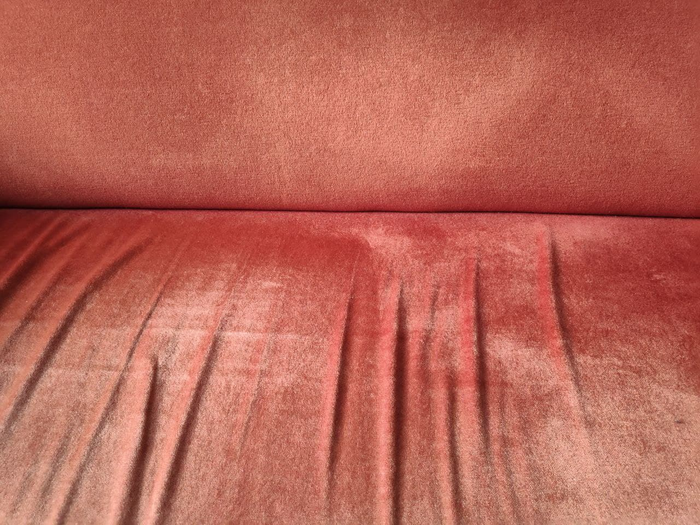
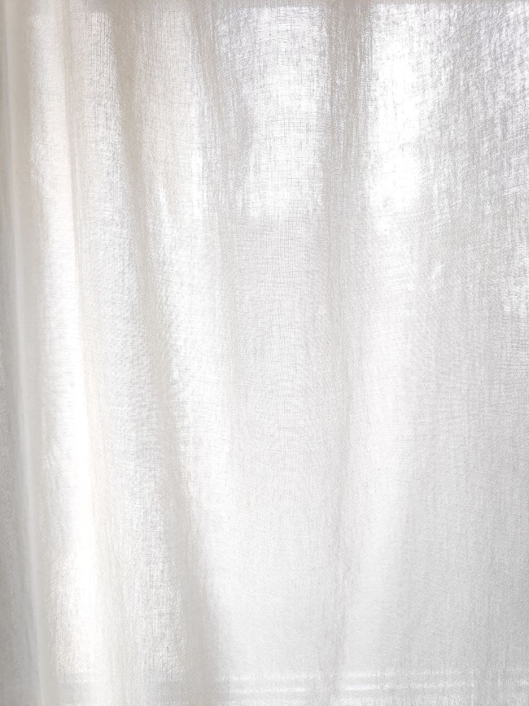
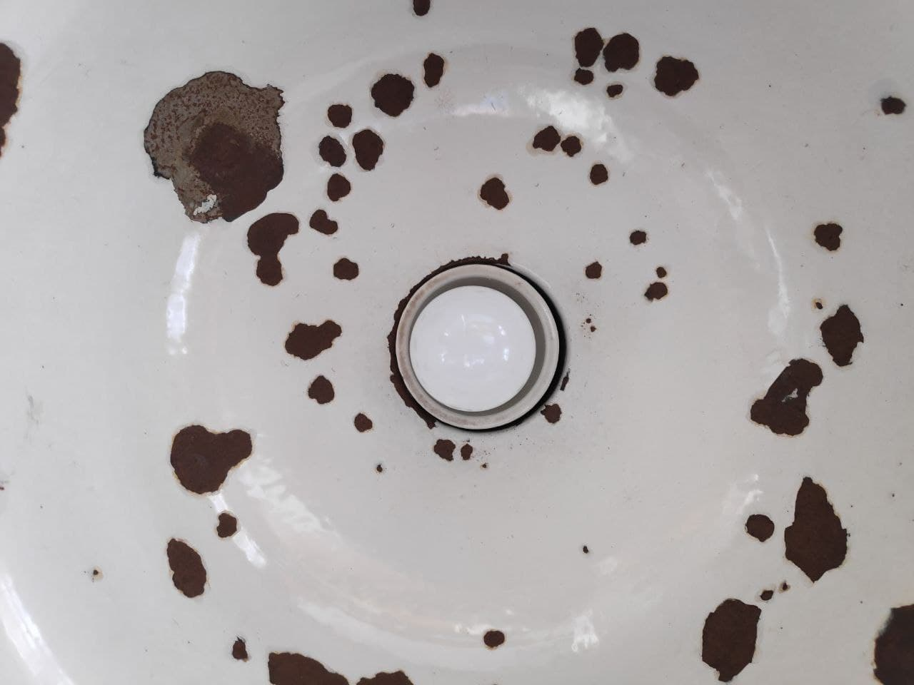
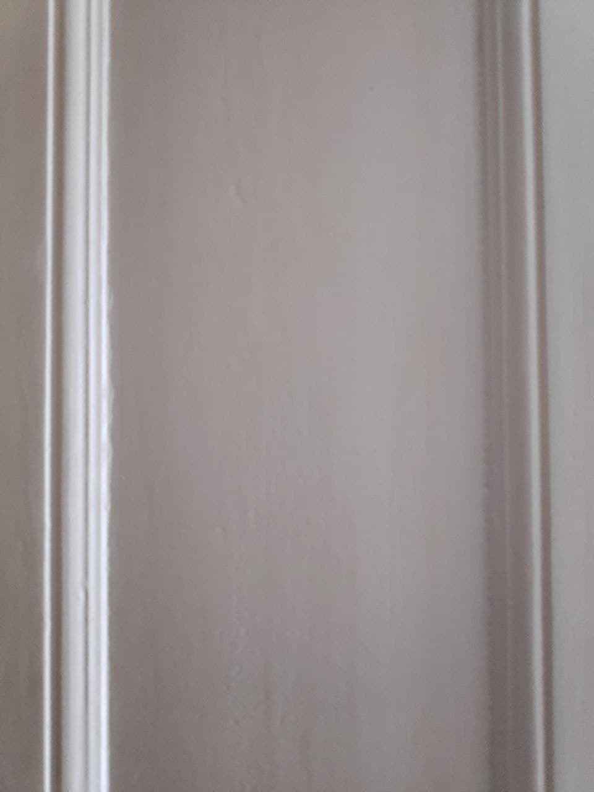
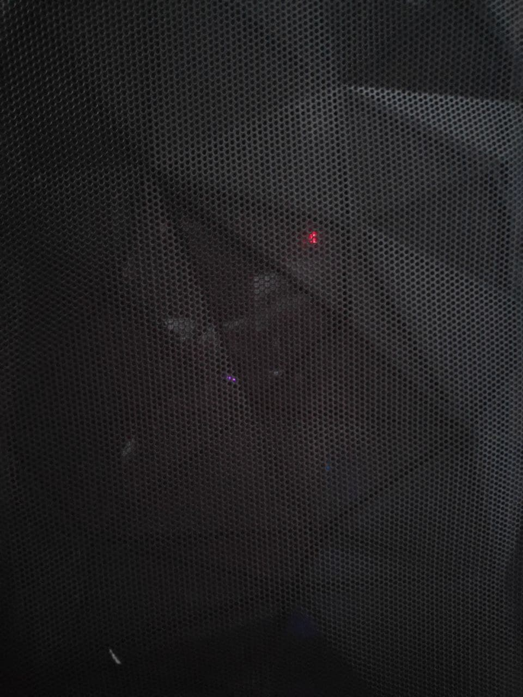
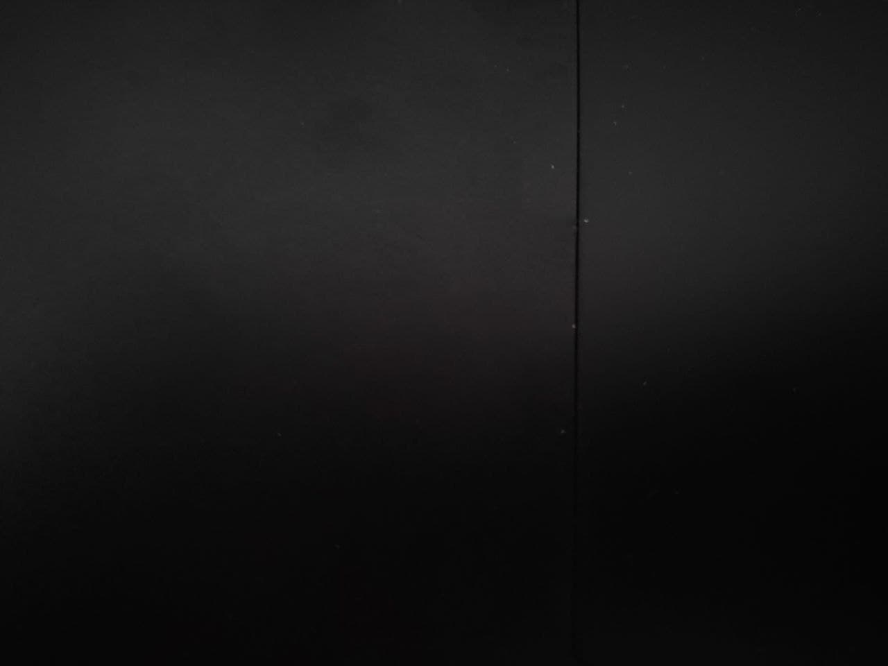

# Exercise 1

## Let`s Look At Some Materials  🔎

Photograph at least 10 materials, including different shadings.

* Add your images to a file `matsha_ws2122_01_exercise_surname.md` (you can use a copy of [`matsha_ws2122_01_exercise_gieseke.md`](submissions/matsha_ws2122_01_exercise_gieseke.md))
* Upload that file to `/docs/exercise/submissions/`
* Link and upload your images to `/docs/exercise/submissions/img/`
* Please add the following header to your .md file at the top:

```
---
layout: default
title: Exercise
nav_exclude: true
---
```

Describe and compare two interesting shading behaviors in your photos as bullet points.

* If possible, move the object and see how it reacts to different lighting situations. 
* How does the shading look like and why?
* What kind of highlights does the object have?
* How do the highlights change when you move the object?
* Add your text to the .md of 1.


**Time: 40 minutes**


## Submissions

* [Lena](submissions/matsha_ws2122_01_exercise_gieseke.md)

---
layout: default
title: Exercise
nav_exclude: true
---







