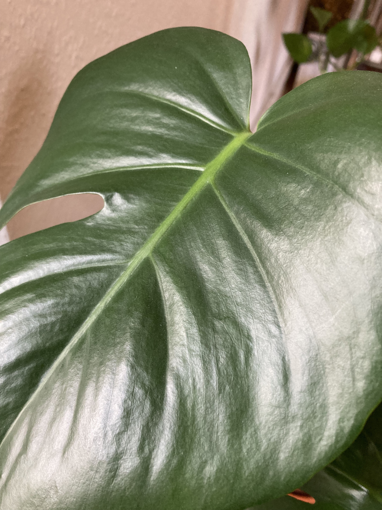
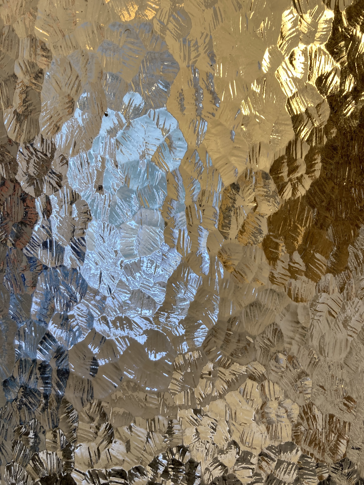
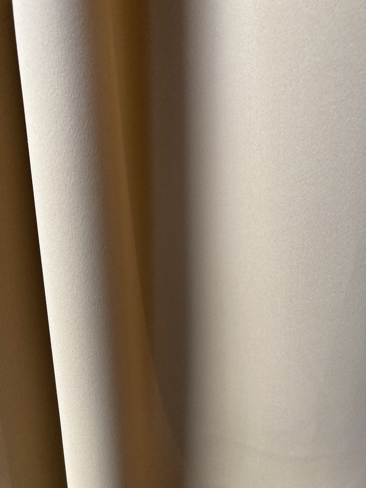
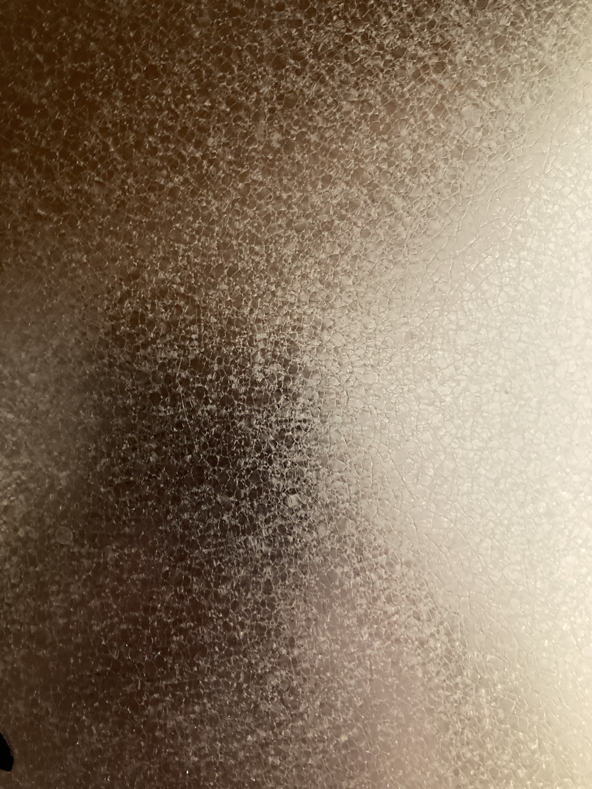
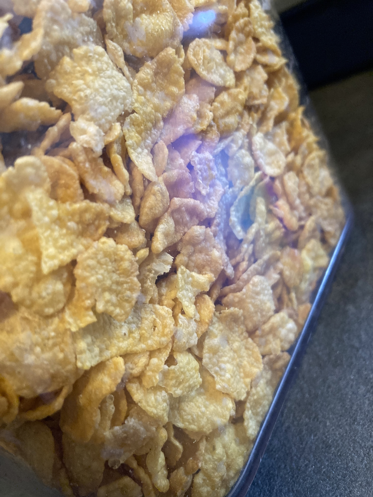
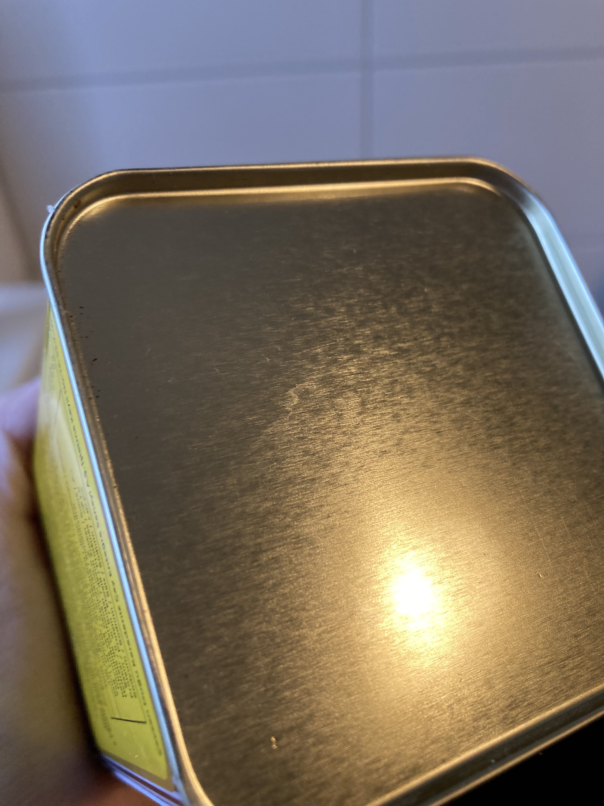

# Materials / Shadings

Those are the materials and shadings I found.

- it has highlightsm where the light hits the leaf
- the lights spreads over the leaf
- high contrast
- on first sight, the leaf feels glatt, but actually, it has a very small, detailed structure that diffuses the light spots

- the small strings that this fabric is made of all reflect the light a lot. But because the strings are so small, the light looks like it is diffused
- depending on the angle, the color of the string changes
- if you straighten the fabric, it looks darker, without any highlights

