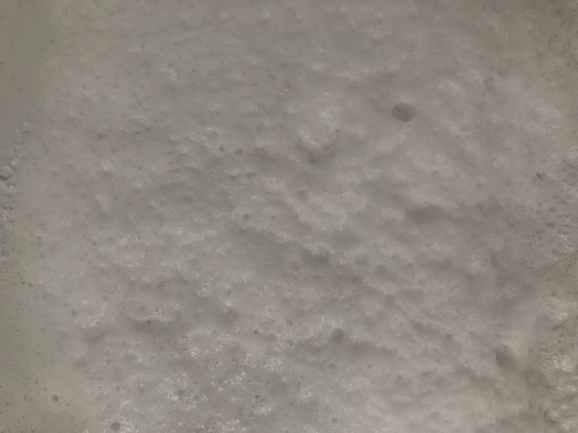
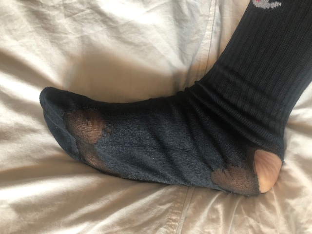
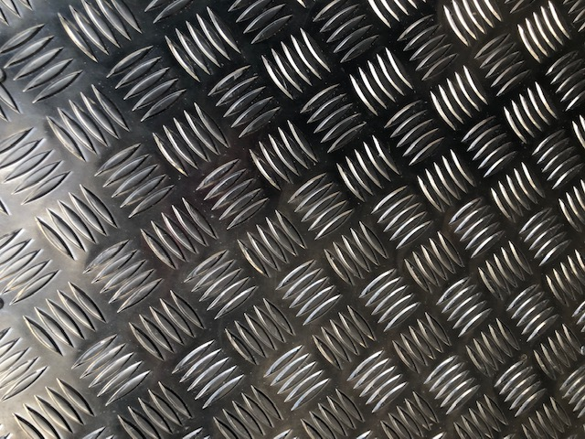
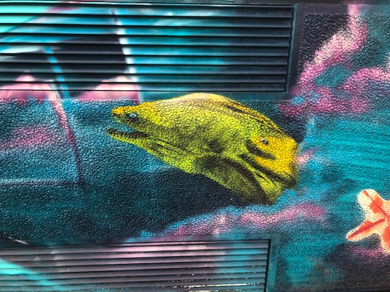
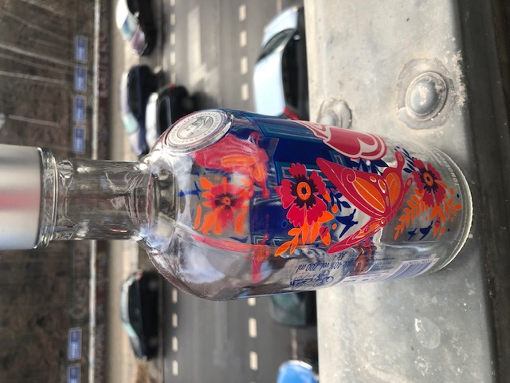
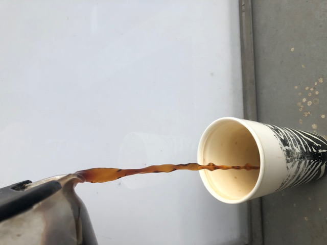
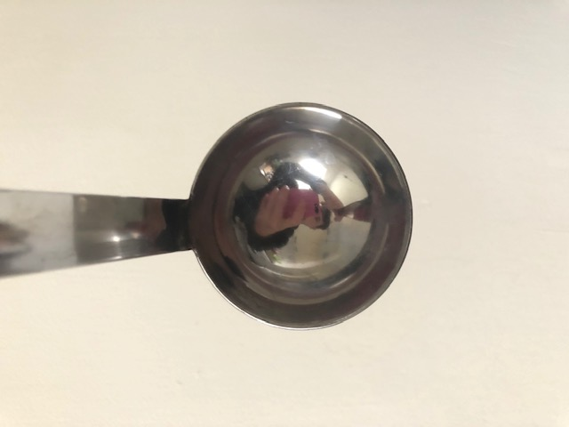
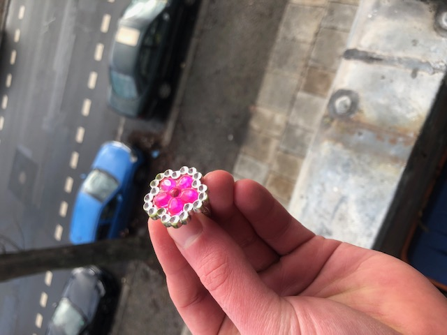

# Malte Hillebrand

## Comparison

- The sock material makes interesting use of the alpha channel, incoporating different opacities to reveal the object behind it
- The ring material is not opaque at all
- The ring is reflective and shiny when in contact with the light source
- The sock not so much, it's rather rough and diffuse in contant with lighting
- The sock uses a bump / normal map for more details
- The ring is translucent in the middle part, the light is reflected behind the pink glass and then bounces back through it, appearing as if it's lit from the inside