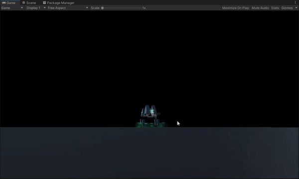
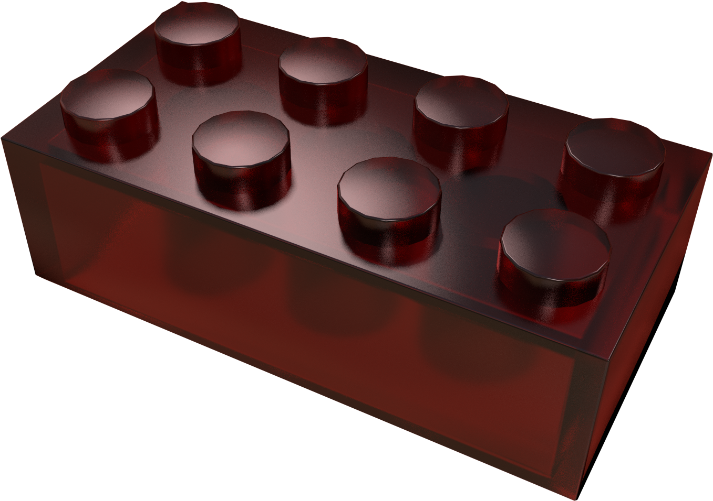
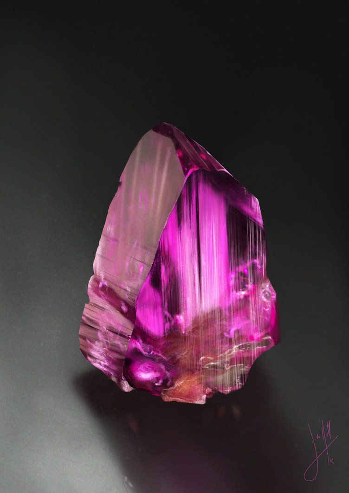
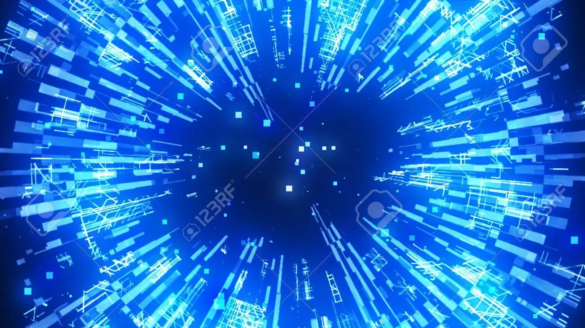
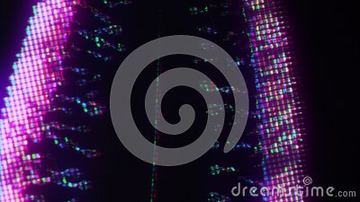

# Exercise 5

### Task 1 - Coding

Based on the theory and the implemented materials, play around with the code and come up with your own material.
This could also be in a different environment than p5.

### Tasl 2 - Concept

Saetta is a little self-contained game snippet I've been working on, involving a digital low-poly fox that charges up energy as it runs. It represents a data carrier in a virtual cyber world. With enough energy it can warp-jump in different directions. The aim was to explore how to implement game mechanics coupled to vfx and animation through the different engines: Unreal, Unity and Godot.

For this exercise I want to look closer at the concept for the platforms the creature travels on. I have a vision about an advanced material implementing these features:

1. A semi-translucent surface, with a slightly shiny core which pulses like a heartbeat to give the minimal aesthetic of the game some "life" (pun intended).

2. a procedurally generated digital burst that expands from the point of impact (when the creature lands after a warp) on the mesh as the epicenter and branches out through its entirety in a ripple motion.

3. A similar texture to the digital burst, highlighting the edges of the platform
(Also have a look at the tail and the virtual "ghost" when powering up a warp. It already implements a sort of translucent digital scanner material)

Another reason why I chose my Unity implementation specifically, is because I wanted to get more familiar with ShaderLab aswell the specifics within the HDRP which uses Ray-Tracing.
