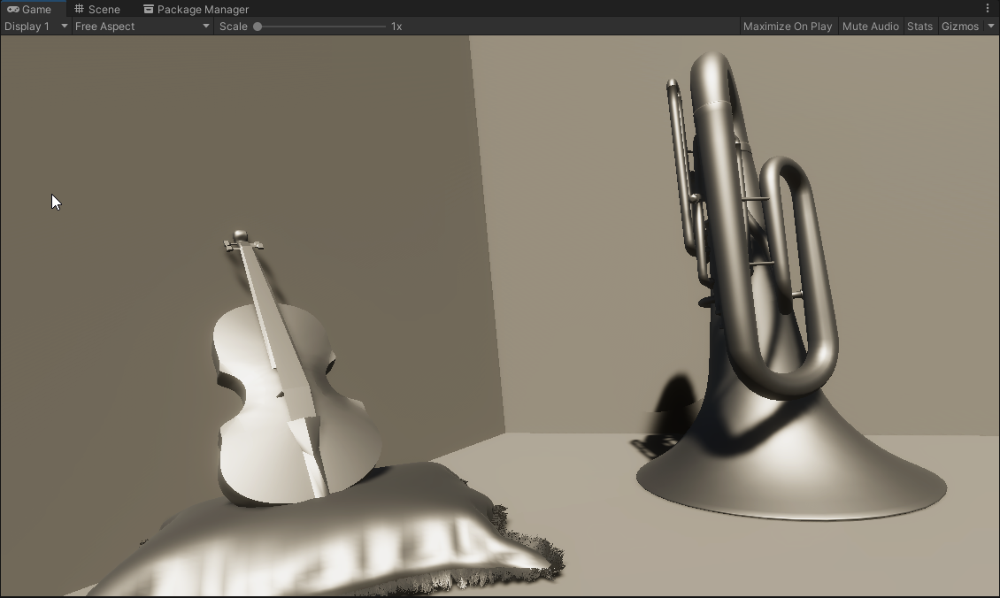
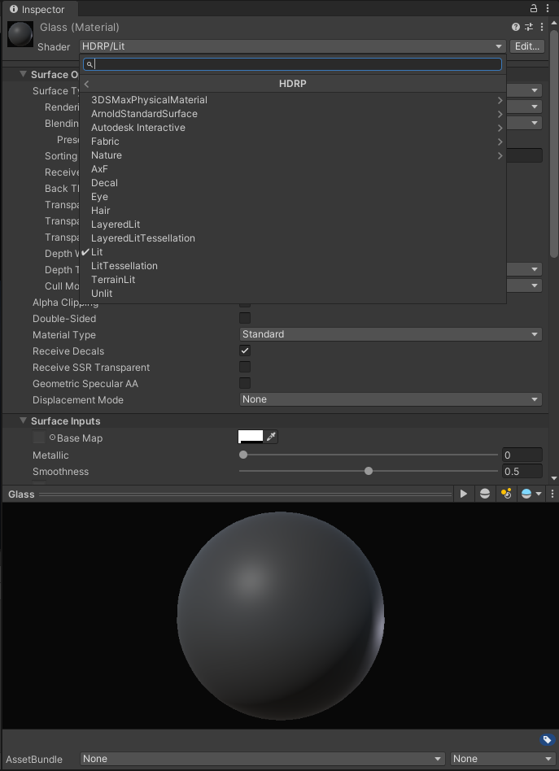
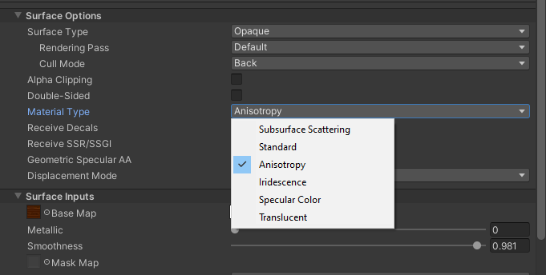
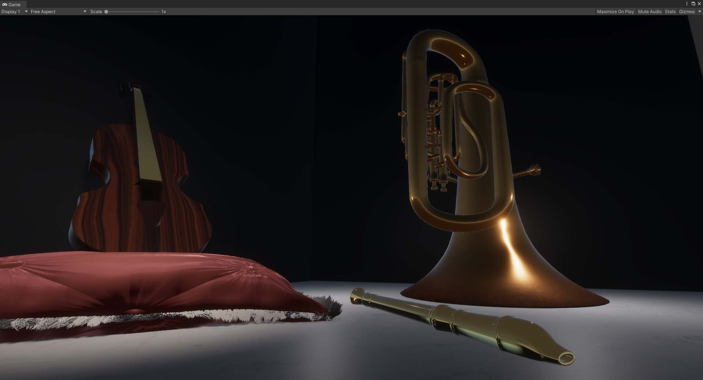

# Exercise 6

## 1. Setup

[https://docs.unity3d.com/Packages/com.unity.render-pipelines.high-definition@14.0/manual/Upgrading-To-HDRP.html](How to activate the High-Definition Render Pipeline in Unity)

The HDRP Comes as a separate package in Unity you can get from the package manager. Once downloaded and installed a setup wizards helps to set everything up almost automatically.

## 2. Material Examination

Unity Uses ShaderLab as Shader Programming API, which compiles to HLSL.
Unity also differentiates between Standard Shader (PBR) and Unlit Shaders. Most non-realistic / special Shaders are implemented as Unlit Shader.

I used this [Glass Tutorial](https://www.youtube.com/watch?v=Gfq1aB2-qtk)

To Affect the global rendering behavior you have to create a Global Volume and override settings like Exposure.
The Lights have to be turned up a lot in the HDRP.

Material Layers are a separate shader that allows to combine many materials. These have to be controlled by a blending mask.

I used the Textile Shader in Silk Setting and a Normal Map for the Pillow.
I used a seamless wood texture with high smoothness for the Violin. I created a brass material that is very smooth and metallic and blended it with a rust texture at the opening rim of the tuba.
I made a translucent flute.