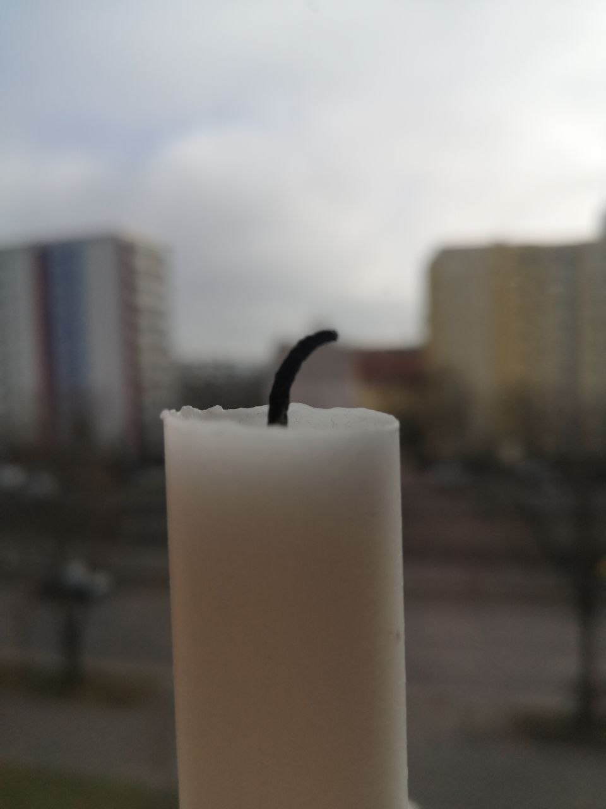
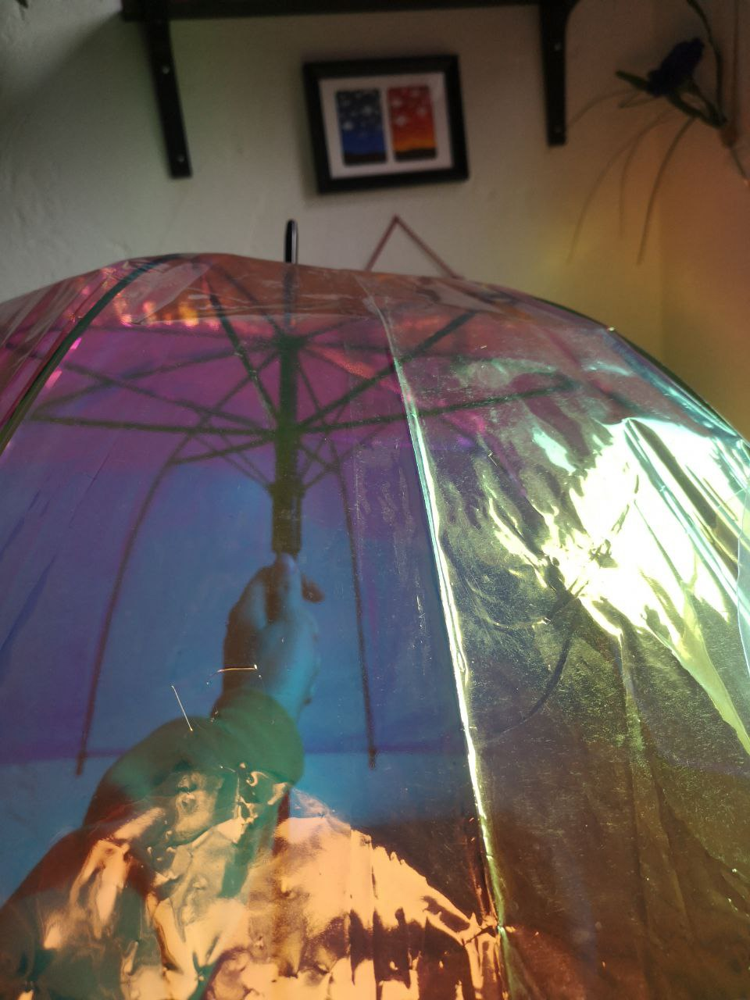
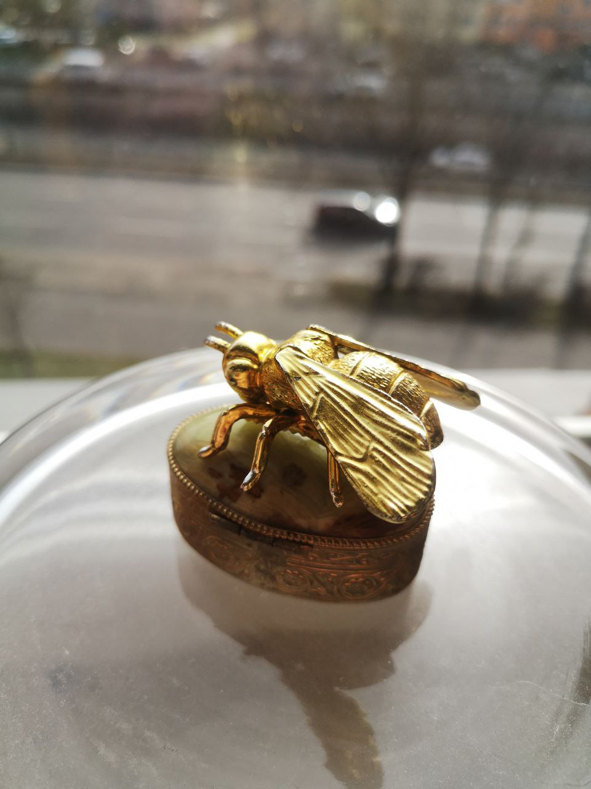
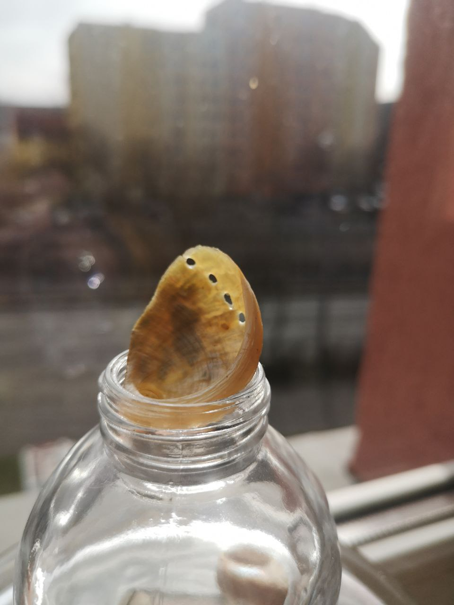

# Material Study

I found the following things:

## 1. Candle in a Glass Bottle

</img> </img>

## 2. Shiny umbrella

</img> </img>

## 3. Metal box with precious stone

</img> </img>

## 4. Blue Velvet

</img> </img>

## 5. Goldplated Bee

</img> </img>

## 6. Egg and Gypsum

</img> </img>
</img> </img>

## 7. Carnations in a Porcelain Vase

</img> </img>

## 8. Glass Skull

</img> </img>

## 9. Beach Treasures

</img> </img>

## 10. The Epoxy Resin Thinker

</img> </img>
</img> </img>
</img> </img>
</img> </img> 

> Describe and compare two interesting shading behaviors in your photos as bullet points:
> If possible, move the object and see how it reacts to different lighting situations.

> How does the shading look like and why?

It looks like it's often just "tinting" and refracting the light. It does not create a "solid" dark shadow, it's shadow always has a colored core.  
Depending on the angle of light and viewpoint, you can look into the sculpture, or not.  
It also has a microtexture on the rough parts (fingerprints, dust and tool marks). The clear parts only have occasional, tiny bubbles and are otherwise super smooth.

> What kind of highlights does the object have?

The clear parts have very sharp highlights and are highly glossy - the rough parts don't.

> How do the highlights change when you move the object?

The object scatters the light throughout it's shape, the rough & clear surface parts let different amounts of light "escape".  
When looking at the object from the same direction as the light source, the object almost looks intransparent, but when looking into the clear surfaces, you can actually look *into* the sculpture.

In general, accurately capturing what it looks like is very hard with a camera. Because the objects refracts so much light, it almost looks like it's glowing itself.
