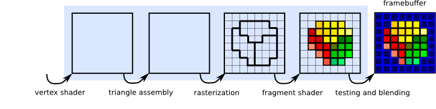
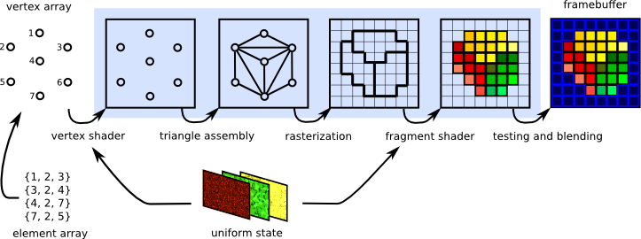
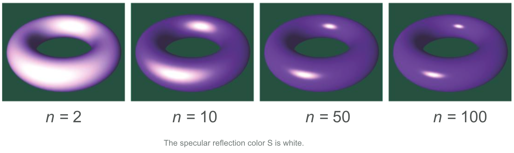

name: inverse
layout: true
class: center, middle, inverse
---

#### Prof. Dr. Lena Gieseke | l.gieseke@filmuniversitaet.de  
#### Film University Babelsberg KONRAD WOLF

# Materials and Shading Workshop

### Day 2

<!--
h or ?: Toggle the help window
j: Jump to next slide
k: Jump to previous slide
b: Toggle blackout mode
m: Toggle mirrored mode.
c: Create a clone presentation on a new window
p: Toggle PresenterMode
f: Toggle Fullscreen
t: Reset presentation timer
<number> + <Return>: Jump to slide <number>
-->

---
layout:false

## Today

--

.center[ ]

--

# 👩🏽‍💻 🧑🏻‍💻 👩🏼‍💻

--

* Implementation of p5's shading functionalities
* NPR Materials, Example: Toon


---

### ***Insight 1:*** We describe the scene setup with vectors

--

We interpret the light transport as the radiance traveling along rays, where

* **L** points to the direction the light is coming from,
* **V** points to the observer and is the direction the light is reflected towards.

||**L**|| = ||**v**|| = 1

.center[]


---

### ***Insight 2:*** We iterate over all lights and sum up their contribution

--

This is based on the physical fact that the contribution of each light adds up linearly. This means that the contribution of each light just needs to be **summed up**.

.center[ [[Scratchapixel]](https://www.scratchapixel.com/lessons/3d-basic-rendering/introduction-to-shading/shading-multiple-lights)]

???

STEP 2: Iterate over lights and sum up

---

### ***Insight 3:*** We work with numeric properties for the lights

--

The computation of the different light intensities, e.g. for a spot light is given by formulas. Today we do not consider these. 

Today we work with (for the sake of simplicity):

* a constant rgb-color for the ambient light, and
* a direction vector and a constant rgb-color for each directional light.


---
template:inverse

### Goal:

## Let's Re-Implement p5's Materials!

## 👩🏽‍💻🧑🏻‍💻

???

.task[TASK:]  

* Code steps 1-17

---
template:inverse

### Remember

## The Shader Pipeline

---
## The Shader Pipeline

What we worked with last time:

.center[]

---

## The Shader Pipeline

What we are working with today:



--
* The 3D engine / host program fills OpenGL-managed memory buffers with arrays of vertices

--
* These vertices are projected into screen space, assembled into triangles, and rasterized into pixel-sized fragments. 

--
* Finally, the fragments are assigned color values and drawn to the framebuffer. 

[[Evas GL Programming Guide]](https://www.enlightenment.org/playground/evas-gl.md)


---
template:inverse

## p5 Scene Setup

---

## p5 Scene Setup

The given scene gives the environment for learning to implement basic shading algorithms. It includes

* Ambient light
* Directional, colored lights
* Ambient material
* Specular material

???

.task[TASK:] Go through code
* Note: specular highlight color can only be set with spec light color


--

p5 has some behavioral specifics but these are straight-forward to understand. The general concepts should be similar in any other 3D rendering context, e.g. in Unity.


???

.task[TASK:] 


* Show p5 source: https://github.com/processing/p5.js/blob/main/src/webgl/shaders/lighting.glsl
* Find uniform variables coming from the environment
* https://github.com/processing/p5.js/blob/1b13b400fcbe2e6c6290262fcf06425dbf4efcf5/contributor_docs/webgl_mode_architecture.md
* Example shadertoy: https://www.shadertoy.com/howto


---

### ***Insight 4:*** Phong Shading Model (BRDF)

--

.center[]

--

A model that recreates believable behavior but has almost no real physical basis.

???

What we just learned refers to one of the most famous and excessively used shading models, namely the *Phong* shading model.

---

## Phong Shading Model (BRDF)

\\( I_{Phong} = I_A + I_D + I_S \\)


With the components modelled as


\\(I_{Ambient} = k_a\\)

\\(I_{Diffuse} = k_d  max(N \cdot L, 0)\\)

\\(I_{Specular} = k_s max(R \cdot V, 0)^n\\)


---
.header[Phong Shading Model]

## Ambient and Diffuse Refelction

```js
light_ambient + light_diffuse * max(L ∙ N, 0);
```

*Reminder:* `light_x` is a rgb color in our context.

--

Let's implement that! 👩🏽‍💻🧑🏻‍💻


???
.task[COMMENT:]  

* TODO: Steps X-X


---
.header[Phong Shading Model]

## Specular Reflection

.center[ ]

\\[{cos^{n}\alpha} = max(0, R \cdot V)^{n}\\]

With n as a *shininess* exponent.

---
.header[Phong Shading Model]

## Shininess exponent

The specular or shininess exponent n controls the sharpness of the specular highlight. 


.center[]

---
.header[Phong Shading Model]

## Specular Reflection

Now, we can compute the specular component of Phong with

```glsl
light_specular * max(0, R ∙ V)^n;
```
--

Hence, in total for Phong we have:

```glsl
light_ambient + shading_diffuse + light_specular * max(0, R ∙ V)^n;
```

--
Let's implement that! 👩🏽‍💻🧑🏻‍💻

???

The expression (N ⋅ L > 0) is a boolean expression that evaluates to 1 if true and 0 otherwise. This prevents specular highlights from showing up at points on a surface that face away from the light source. 

---
template: inverse

## BRDF?

---

## Phong BRDF

In summary, for shading a surface with the Phong material, we compute how much of the incoming light intensity is reflected on a surface point for a certain view vector, based on the Phong formula.

--

\\(I_{Phong} = k_a + k_s max(R \cdot V, 0)^n  I  + k_s max(R \cdot V, 0)^n I \\)

--

*A BRDF computes the ratio of the incoming to the exiting light.*

--

BRDF stand for ***Bidirectional Reflectance Distribution Functions ***.

---

## Bidirectional Reflectance Distribution Functions

To describe the reflectance behavior on a surface point there are various different ***Bidirectional Reflectance Distribution Functions (BRDF)***.

--

.center[[[Montes 2012]](https://digibug.ugr.es/bitstream/handle/10481/19751/rmontes_LSI-2012-001TR.pdf)]

---

## BRDFs

The BRDF \\( {f(\omega_{\text{i}}, \omega{\text{r}})} \\) is a function of four variables:
<!-- The BRDF \\({f(\omega\us{\text{i}}, \omega\us{\text{r}})}\\) is a function of four variables: -->

.center[ [[Wikipedia]](https://en.wikipedia.org/wiki/Bidirectional_reflectance_distribution_function)]


???

Each direction \omega is itself parameterized by azimuth angle \phi and zenith angle \theta, therefore the BRDF as a whole is a function of 4 variables. 

--

\\(\omega_{\text{i}}\\) and \\(\omega{\text{r}}\\) are equivalent to **L**  and **R**.
 

--

The BRDF returns the *ratio* of incoming irradiance to reflected radiance. 


???

The correct  computation of BRDFs an be very complex and mathematically challenging.

The units of radiance and irradiance are quite crucial here, but of ot scope of this workshop.  

If the material is homogeneous – every surface point has the same appearance

--

By computing the value of a given BRDF for all surface points, we have a description of the surface's shading behavior.


---
## BRDFs

Where are BRDFs coming from?

--

* Measured from material samples using calibrated cameras and lightsources
    * In tabular form: expensive, requires interpolation for rendering
    * Editing is difficult

---
.header[BRDFs]

### MERL BRDF Database

.center[ [[Matusik 2003]](https://www.merl.com/brdf/)]

???

The MERL BRDF database contains reflectance functions of 100 different materials.  

CHECK: It works like a look up table: for each angle pair, you have a value stored.
TODO: Martins slides? Stuttgart exercises?

---

## BRDFs

How do we get BRDFs?

* Measured from material samples using calibrated cameras and lightsources
    * In tabular form: expensive, requires interpolation for rendering
    * Editing is difficult

* Phenomenologically motivated models
    * Few, intuitive parameters
    * Only limited realism
    * Phong [1975], Blinn-Phong [1977], Ward [1992], Lafortune et al. [1997], Ashikhmin et al. [2000],...

???

There are phenomenological BRDF models. They use mathematical expressions to create a function that reproduces an intended physical effect.


Examples: the Phong model [Phong 1975], the Blinn-Phong model [Blinn 1977], the Ward model [Ward 1992] (some physical motivation, though), the Lafortune model [Lafortune et al. 1997], the Ashikhmin-Shirley model [Ashikhmin and Shirley 2000]

--

* Physically motivated models
    * More exact results
    * Tuning parameters more difficult
    * Cook-Torrance [1981], He et al. [1991]


---

## BRDFs

* Hybrid models
    * Maximize artist ease-of-use 
    * Physical realism
    * *Disney*-BRDF [Burley 2012a] / [Burley 2012b]

???

* https://people.cs.clemson.edu/~ekp/courses/dpa8090/assets/papers/PBS_at_Disney.pdf


---

## BRDFs

The previously mentioned BRDFs were all models for the "simple" case of

.center[]

---

## BRDFs

But what about?

.center[]

---

## BRDFs

BSDF (bidirectional scattering distribution function)

.center[[[wiki]](https://www.wikiwand.com/en/Bidirectional_scattering_distribution_function)]

---

## BRDFs

BSSRDF (Bidirectional scattering-surface reflectance distribution function or Bidirectional surface scattering RDF)

.center[[[wiki]](https://www.wikiwand.com/en/Bidirectional_scattering_distribution_function)]

--

More variables are needed!


---

## BRDFs

.center[]

???

* Isotropic reflection: reflection doesn't vary as the surface os rotated
* SVBRDF: Spatially varying
* BSSRDF: Bidirectional scattering distribution function

---

## Local Illumination

Well, that is all nice and well but what is still missing?

???

.task[TASK:] What is missing?

--

.center[]

---
template:inverse

# Global Illumination

---

## Global Illumination

We need light from all directions!

.center[]


---

## Global Illumination

We need light from all directions!

.center[]

---

## Local Illumination

.center[ ]  
.footnote[[[wiki](https://www.wikiwand.com/en/Global_illumination)]]

---

## Global Illumination

.center[]  
.footnote[[[wiki](https://www.wikiwand.com/en/Global_illumination)]]


---
template: inverse

## Rendering Equation

---

## Rendering Equation

How much light is emitted and reflected on surface point x?

--

.center[]

---

## Rendering Equation

Light from all directions...

--

.center[]

---

## Rendering Equation

Reflectance?

--

BRDF!

--

.center[]

---

## Rendering Equation

BRDF with what? Which light do we get?

--

.center[]

---

## Rendering Equation

Bad news:

--

The incoming light in x is the rendering equation of y...

--

.center[]


---

## Rendering Equation

.center[]

--

Infinite-dimensional!

--

.center[]

--

Once again, 'solutions' are acceptable approximations...

---
.header[Global Illumination]

## Example: More Rays

.center[]


???
.task[COMMENT:]  

* Ray tracing, radiosity, (bi-directional) path tracing, Metropolis light transport, precomputed radiance transfer, (stochastic progressive) photon mapping, irradiance caching, path space regularization, vertex connection and merging


* Monte-Carlo Ray and Path Tracing
    * Stochastic integral solutions
    * Noise from variance in stochastic processes

* Photon Mapping
    * Distribute light particles in scene, then ray tracing
    * Good for spatially focused light effects such as caustics


* Radiosity
    * Finite element method: surfaces each divided up into one or more smaller surfaces
    * Light is simulated between patches based on a view factor
    * Reduces the infinite dimensional rendering equation to a finite number of dimensions
    * Efficient for overall smooth lighting and reflections


* https://ohiostate.pressbooks.pub/graphicshistory/chapter/19-5-global-illumination/


---
template:inverse

# Now, Let's Have Some Fun...


???

.task[TASK:] What are the visual properties of a toon shader?

.task[TASK:] Show rendering

---

## Toon

--

* Flat shading
* Step function for diffuse shading
* Outline
* Small light highlight
* Outline around highlight

???

* https://www.youtube.com/watch?v=N49saz3AnlU


---
template:inverse

## Let's Implement This!

## 👩🏽‍💻🧑🏻‍💻

---

## Creative Shader Ideas 🤩

--

How could we use custom-made materials and shading creatively?


* Brainstorm 
* Feel free to use the internet, e.g. shader toy as inspiration
    * [Ballpoint Shader](https://shaderoo.org/?shader=yMP3J7)
    * [Cycles Material Studies](http://www.reynantemartinez.com/cycles-material-studies.html)
    * [Material Studies - Metal](https://hasenjager.cgsociety.org/zkgx/material-studies-met)
    * [Material Studies - Snow](https://hasenjager.cgsociety.org/w3p3/material-studies-sno)
    * [Material Studies - Minerals](https://www.behance.net/gallery/74271431/Material-Studies-Minerals)
    * [Decay in Unreal](https://www.artstation.com/artwork/q08rL)
* Roughly describe your ideas in a .md file


---
template: inverse

### The End of Day 2

## 🤯
