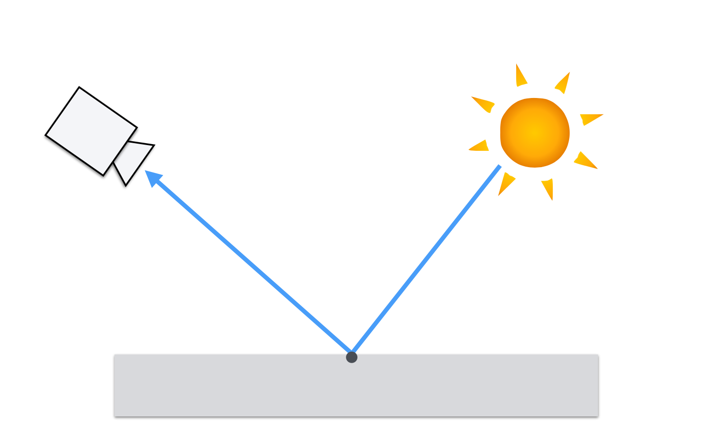
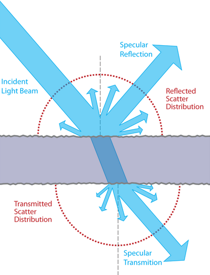
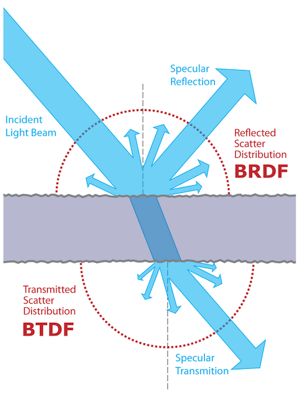
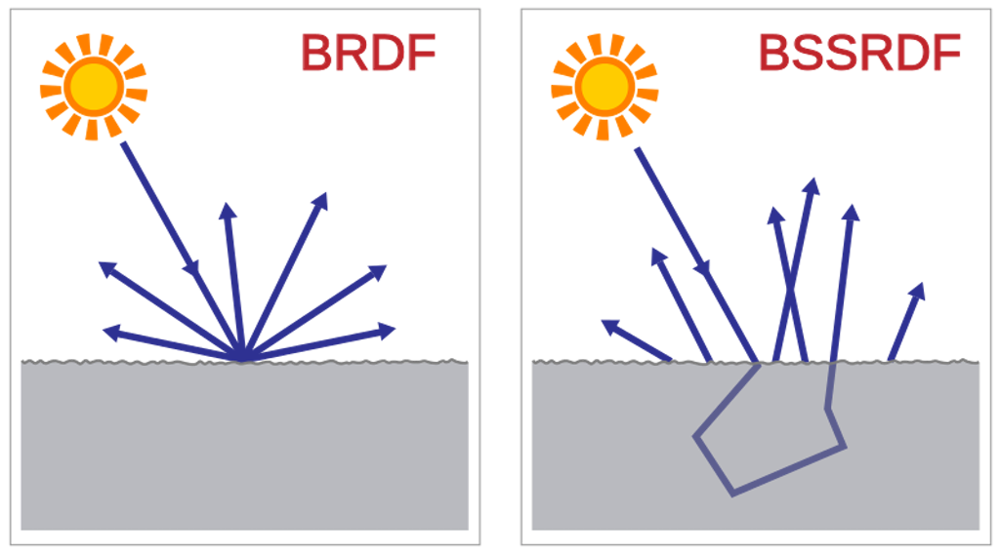

name: inverse
layout: true
class: center, middle, inverse
---

#### Prof. Dr. Lena Gieseke | l.gieseke@filmuniversitaet.de  
#### Film University Babelsberg KONRAD WOLF

# Materials and Shading Workshop

### 05 - BRDF

<!--
h or ?: Toggle the help window
j: Jump to next slide
k: Jump to previous slide
b: Toggle blackout mode
m: Toggle mirrored mode.
c: Create a clone presentation on a new window
p: Toggle PresenterMode
f: Toggle Fullscreen
t: Reset presentation timer
<number> + <Return>: Jump to slide <number>
-->

---
template: inverse

## BRDF?

---
layout:false

## Phong BRDF

In summary, for shading a surface with the Phong material, we compute how much of the incoming light intensity is reflected on a surface point for a certain view vector, based on the Phong formula.

--

\\(I_{Phong} = k_a + k_s max(R \cdot V, 0)^n  I  + k_s max(R \cdot V, 0)^n I \\)

--

*A BRDF computes the ratio of the incoming to the exiting light.*

--

BRDF stand for ***Bidirectional Reflectance Distribution Functions ***.

---

## Bidirectional Reflectance Distribution Functions

To describe the reflectance behavior on a surface point there are various different ***Bidirectional Reflectance Distribution Functions (BRDF)***.

--

.center[[[Montes 2012]](https://digibug.ugr.es/bitstream/handle/10481/19751/rmontes_LSI-2012-001TR.pdf)]

---

## BRDFs

The BRDF \\( {f(\omega_{\text{i}}, \omega{\text{r}})} \\) is a function of four variables:
<!-- The BRDF \\({f(\omega\us{\text{i}}, \omega\us{\text{r}})}\\) is a function of four variables: -->

.center[ [[Wikipedia]](https://en.wikipedia.org/wiki/Bidirectional_reflectance_distribution_function)]

???

Each direction \omega is itself parameterized by azimuth angle \phi and zenith angle \theta, therefore the BRDF as a whole is a function of 4 variables. 

--

\\(\omega_{\text{i}}\\) and \\(\omega{\text{r}}\\) are equivalent to **L**  and **R**.
 

--

The BRDF returns the *ratio* of incoming irradiance to reflected radiance. 

???

The correct  computation of BRDFs an be very complex and mathematically challenging.

The units of radiance and irradiance are quite crucial here, but of ot scope of this workshop.  

If the material is homogeneous – every surface point has the same appearance

--

By computing the value of a given BRDF for all surface points, we have a description of the surface's shading behavior.

---
## BRDFs

Where are BRDFs coming from?

--

* Measured from material samples using calibrated cameras and lightsources
    * In tabular form: expensive, requires interpolation for rendering
    * Editing is difficult

---
.header[BRDFs]

### MERL BRDF Database

.center[ [[Matusik 2003]](https://www.merl.com/brdf/)]

???

The MERL BRDF database contains reflectance functions of 100 different materials.  

CHECK: It works like a look up table: for each angle pair, you have a value stored.
TODO: Martins slides? Stuttgart exercises?

---

## BRDFs

How do we get BRDFs?

* Measured from material samples using calibrated cameras and lightsources
    * In tabular form: expensive, requires interpolation for rendering
    * Editing is difficult

* Phenomenologically motivated models
    * Few, intuitive parameters
    * Only limited realism
    * Phong [1975], Blinn-Phong [1977], Ward [1992], Lafortune et al. [1997], Ashikhmin et al. [2000],...

???

There are phenomenological BRDF models. They use mathematical expressions to create a function that reproduces an intended physical effect.

Examples: the Phong model [Phong 1975], the Blinn-Phong model [Blinn 1977], the Ward model [Ward 1992] (some physical motivation, though), the Lafortune model [Lafortune et al. 1997], the Ashikhmin-Shirley model [Ashikhmin and Shirley 2000]

--

* Physically motivated models
    * More exact results
    * Tuning parameters more difficult
    * Cook-Torrance [1981], He et al. [1991]

---

## BRDFs

* Hybrid models
    * Maximize artist ease-of-use 
    * Physical realism
    * *Disney*-BRDF [Burley 2012a] / [Burley 2012b]

???

* https://people.cs.clemson.edu/~ekp/courses/dpa8090/assets/papers/PBS_at_Disney.pdf

---

## BRDFs

The previously mentioned BRDFs were all models for the "simple" case of

.center[]

---

## BRDFs

But what about?

.center[]

---

## BRDFs

BSDF (bidirectional scattering distribution function)

.center[[[wiki]](https://www.wikiwand.com/en/Bidirectional_scattering_distribution_function)]

---

## BRDFs

BSSRDF (Bidirectional scattering-surface reflectance distribution function or Bidirectional surface scattering RDF)

.center[[[wiki]](https://www.wikiwand.com/en/Bidirectional_scattering_distribution_function)]

--

More variables are needed!

---

## BRDFs

.center[]

???

* Isotropic reflection: reflection doesn't vary as the surface os rotated
* SVBRDF: Spatially varying
* BSSRDF: Bidirectional scattering distribution function
