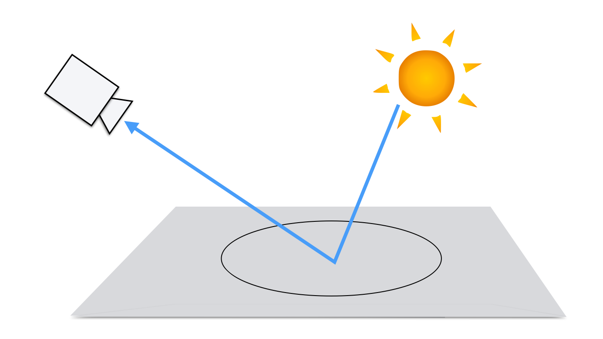
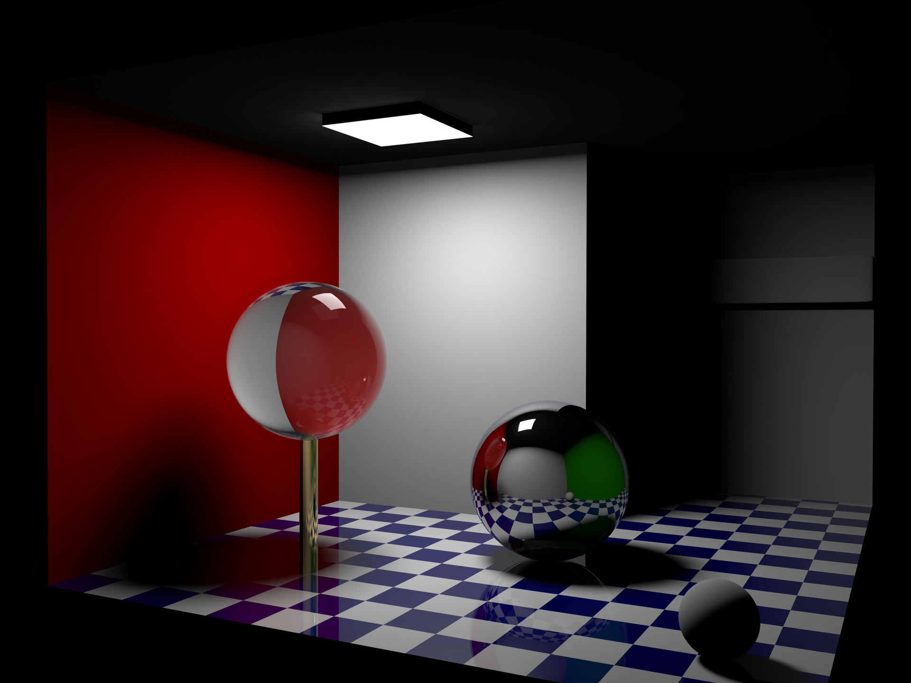
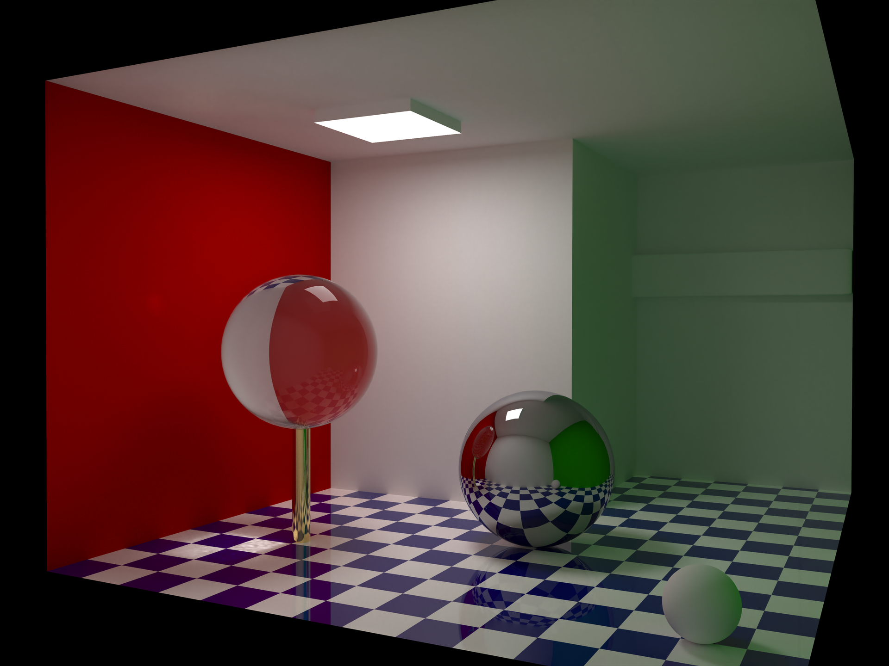
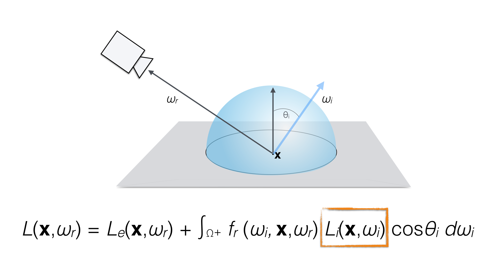

name: inverse
layout: true
class: center, middle, inverse
---

#### Prof. Dr. Lena Gieseke | l.gieseke@filmuniversitaet.de  
#### Film University Babelsberg KONRAD WOLF

# Materials and Shading Workshop

### 06 - Global Illumination

<!--
h or ?: Toggle the help window
j: Jump to next slide
k: Jump to previous slide
b: Toggle blackout mode
m: Toggle mirrored mode.
c: Create a clone presentation on a new window
p: Toggle PresenterMode
f: Toggle Fullscreen
t: Reset presentation timer
<number> + <Return>: Jump to slide <number>
-->

---
layout:false

## Local Illumination

Well, that is all nice and well but what is still missing?

???

.task[TASK:] What is missing?

--

.center[]

---
template:inverse

# Global Illumination

---

## Global Illumination

We need light from all directions!

.center[]

---

## Global Illumination

We need light from all directions!

.center[]

---

## Local Illumination

.center[ ]  
.footnote[[[wiki](https://www.wikiwand.com/en/Global_illumination)]]

---

## Global Illumination

.center[]  
.footnote[[[wiki](https://www.wikiwand.com/en/Global_illumination)]]

---
template: inverse

## Rendering Equation

---

## Rendering Equation

How much light is emitted and reflected on surface point x?

--

.center[]

---

## Rendering Equation

Light from all directions...

--

.center[]

---

## Rendering Equation

Reflectance?

--

BRDF!

--

.center[]

---

## Rendering Equation

BRDF with what? Which light do we get?

--

.center[]

---

## Rendering Equation

Bad news:

--

The incoming light in x is the rendering equation of y...

--

.center[]

---

## Rendering Equation

.center[]

--

Infinite-dimensional!

--

.center[]

--

Once again, 'solutions' are acceptable approximations...

---
.header[Global Illumination]

## Example: More Rays

.center[]

???
.task[COMMENT:]  

* Ray tracing, radiosity, (bi-directional) path tracing, Metropolis light transport, precomputed radiance transfer, (stochastic progressive) photon mapping, irradiance caching, path space regularization, vertex connection and merging

* Monte-Carlo Ray and Path Tracing
    * Stochastic integral solutions
    * Noise from variance in stochastic processes

* Photon Mapping
    * Distribute light particles in scene, then ray tracing
    * Good for spatially focused light effects such as caustics

* Radiosity
    * Finite element method: surfaces each divided up into one or more smaller surfaces
    * Light is simulated between patches based on a view factor
    * Reduces the infinite dimensional rendering equation to a finite number of dimensions
    * Efficient for overall smooth lighting and reflections

* https://ohiostate.pressbooks.pub/graphicshistory/chapter/19-5-global-illumination/

