name: inverse
layout: true
class: center, middle, inverse
---

#### Prof. Dr. Lena Gieseke | l.gieseke@filmuniversitaet.de  
#### Film University Babelsberg KONRAD WOLF

# Materials and Shading Workshop

### 07 - Day 3

<!--
h or ?: Toggle the help window
j: Jump to next slide
k: Jump to previous slide
b: Toggle blackout mode
m: Toggle mirrored mode.
c: Create a clone presentation on a new window
p: Toggle PresenterMode
f: Toggle Fullscreen
t: Reset presentation timer
<number> + <Return>: Jump to slide <number>
-->

---
layout:false

## What happened so far?

* Intro to Shading
* Local Illumination
* Local Shading Models
* Global Illumination and the Rendering Equation

  
* Implementation of p5's material

---
template:inverse

## Recap

---

## Local Illumination

???

.task[ASK:]  

* How do you describe local illumination

--

.center[]

---

## BRDFs

???

.task[ASK:]  

* What is a BRDF?

--

BRDF stands for ***Bidirectional Reflectance Distribution Functions (BRDF)***.
 
BRDFs describe the reflectance behavior on a surface point. A BRDF returns the *ratio* of incoming irradiance to reflected radiance. 


The BRDF \\( {f(\omega{\text{i}}, \omega{\text{r}})} \\) is a function of four variables:
<!-- The BRDF \\({f(\omega\us{\text{i}}, \omega\us{\text{r}})}\\) is a function of four variables: -->

.center[ [[Wikipedia]](https://en.wikipedia.org/wiki/Bidirectional_reflectance_distribution_function)]

???

.task[COMMENT:]  

* Each direction \omega is itself parameterized by azimuth angle \phi and zenith angle \theta, therefore the BRDF as a whole is a function of 4 variables. 
* Research on BRDFs is still going strong: https://conferences.eg.org/eg2021/program/full-papers/
* https://github.com/romanlarionov/BRDFViewer
* https://github.com/chicio/Spectral-BRDF-Explorer

---

.header[BRDFs]

## Diffuse Reflection


.center[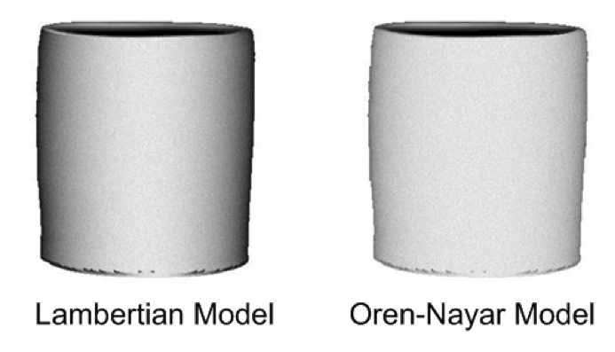[[wiki]](http://en.wikipedia.org/wiki/Oren–Nayar_reflectance_model
)]


???
.task[COMMENT:]  

* Lambert is too dark when we compute it in grazing angles.
* Solution: Oren-Nayar BRDF model


---

.header[BRDFs]

## Diffuse Reflection


.center[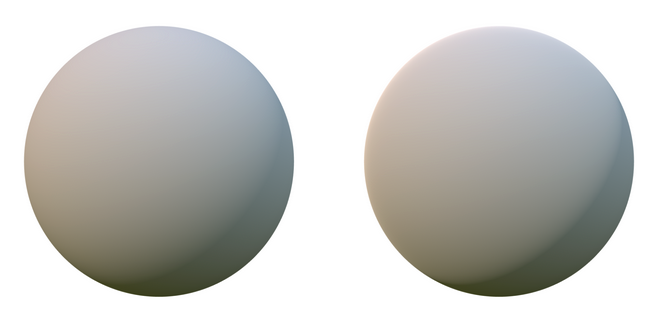[[filament]](https://google.github.io/filament/Filament.html#materialsystem)]


???
.task[COMMENT:]  

*  a comparison between a simple Lambertian diffuse BRDF and the higher quality Disney diffuse BRDF, using a fully rough dielectric material. For comparison purposes, the right sphere was mirrored. The surface response is very similar with both BRDFs but the Disney one exhibits some nice retro-reflections at grazing angles (look closely at the left edge of the spheres). 

---

.header[BRDFs]

## Diffuse & Specular Reflection

.center[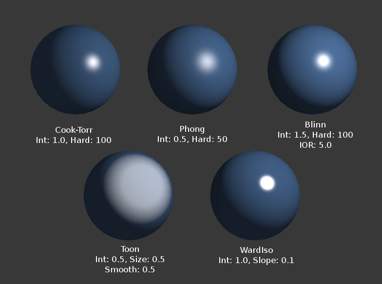 [[blender]](https://docs.blender.org/manual/en/2.79/render/blender_render/materials/properties/diffuse_shaders.html)]

---

.header[BRDFs]

## Glossiness

BRDFs are often a carful mixture of diffuse und specular reflection, e.g. for glossiness.

--

Glossiness is between the diffuse and specular BRDF. It has broader highlights than a mirror and is more view-dependent than a diffuse surface.


.footnote[[TU Wien | Rendering 186.101 | Károly Zsolnai-Fehér]]

---

.header[BRDFs]

## Glossiness

.center[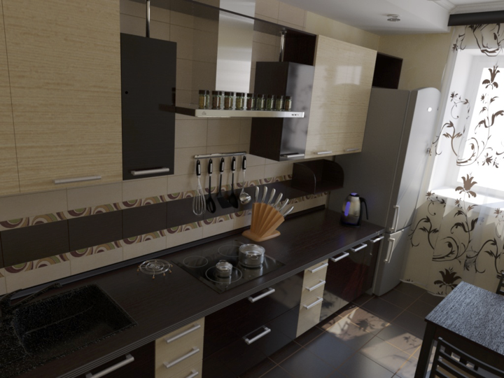[[strelok]](http://www.luxrender.net/forum/gallery2.php?g2_itemId=16543)]

.footnote[[TU Wien | Rendering 186.101 | Károly Zsolnai-Fehér]]

---

.header[BRDFs]

## Glossiness

.center[[[strelok]](http://www.luxrender.net/forum/gallery2.php?g2_itemId=16543)]

.footnote[[TU Wien | Rendering 186.101 | Károly Zsolnai-Fehér]]

---

.header[BRDFs]

## Disney BRDF Explorer

.center[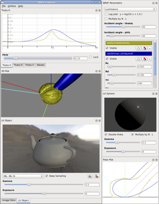 [[Disney]]()]


---
.header[BRDFs]

## Phong

.center[]

???
.task[COMMENT:]  

* Works how?
* Explain bug with float precision

---

## Global Illumination

???

.task[ASK:]  

* What does global illumination refer to?

--

.center[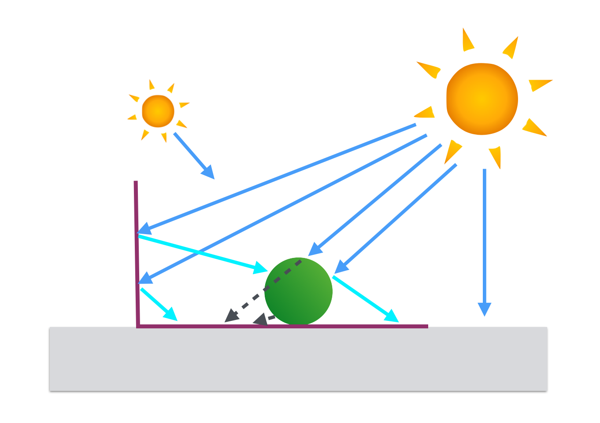]

---
.header[Globale Illumination]

## Indirect Illumination

.center[ [[aztadom]](http://aztadom.co/wp-content/uploads/2014/04/cuki_aranyos_allat_10.jpg
)]

.footnote[[TU Wien | Rendering 186.101 | Károly Zsolnai-Fehér]]

---
.header[Globale Illumination]

## Indirect Illumination

.center[ [[fantasylab]](http://www.fantasylab.com/newpages/back.jpg)]

.footnote[[TU Wien | Rendering 186.101 | Károly Zsolnai-Fehér]]

---
.header[Globale Illumination]

## Indirect Illumination

.center[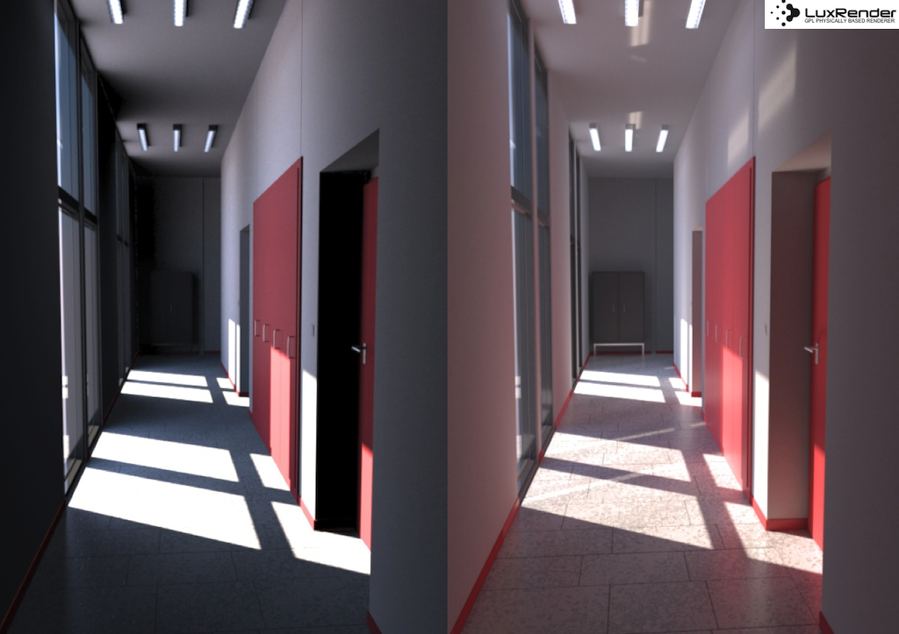 [[Lux Renderer]]()]

.footnote[[TU Wien | Rendering 186.101 | Károly Zsolnai-Fehér]]


---

## Global Illumination

We need light from all directions!

.center[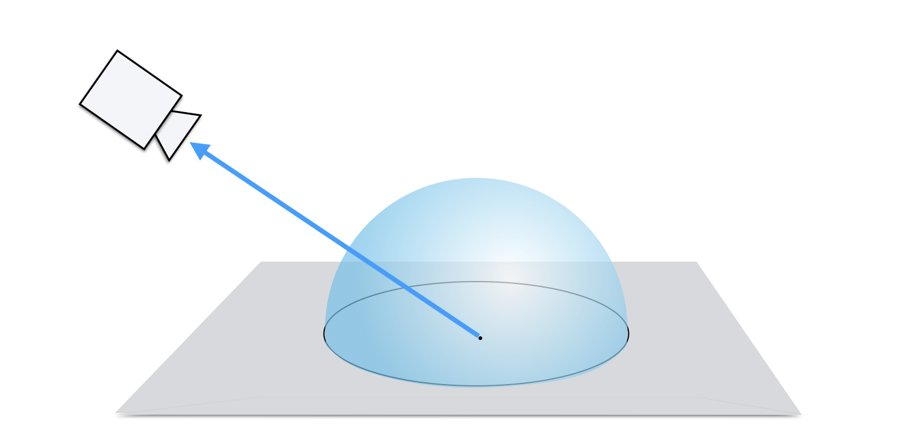]

---

## Rendering Equation


.center[]

--

The outgoing light is the sum of the emitted light and the reflected light. 

--

The reflected light itself is the sum from all directions of the incoming light multiplied by the surface reflection and cosine of the incident angle. 

???

.task[ASK:]  

* What does it do?
* The physical basis for the rendering equation is the law of conservation of energy.  

---

## Rendering Equation


.center[]


---

## Rendering Equation

.center[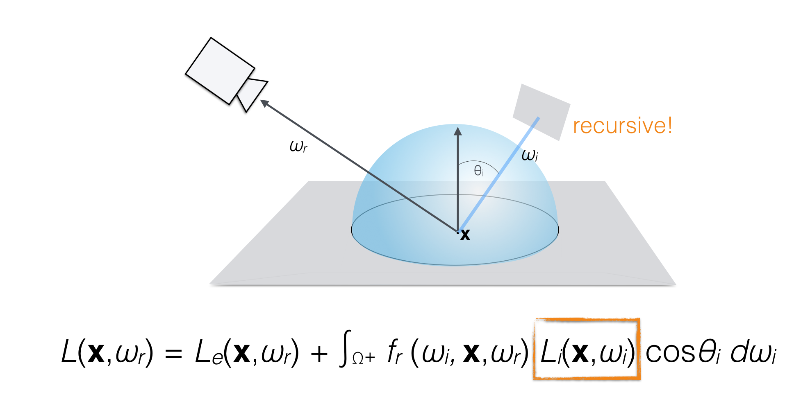]


---
template:inverse

# Today

---

# Today

.left-even[
* NPR shading, example toon
]
.right-even[]


---

# Today

.left-even[
* NPR shading, example toon
* Fresnel effect
]
.right-even[]

---

# Today

.left-even[
* NPR shading, example toon
* Fresnel effect
]
.right-even[ 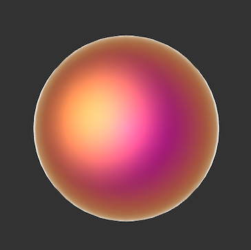]

---

## NPR Shading

--

.center[]

???

.task[ASK:]  

* Show live version
* What properties do you see?
    * Flat shading
    * Step function for diffuse shading
    * Outline
    * Small light highlight
    * Outline around highlight 


---

## NPR Shading

Many NPR shaders make use of the outline of an object.

???

.task[ASK:]  

* How do we detect the outline?

--

The outline of an object is detected by the angle between the normal of the surface point and the view vector.

--

.center[]

---

## NPR Shading

Many NPR shaders make use of the outline of an object.

The outline of an object is detected by the angle between the normal of the surface point and the view vector.

.center[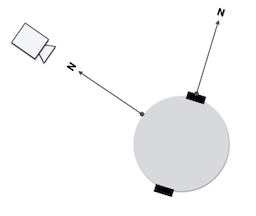]

---

## NPR Shading

Many NPR shaders make use of the outline of an object.

The outline of an object is detected by the angle between the normal of the surface point and the view vector.

.center[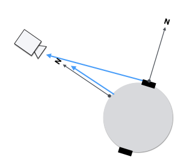]

--

\\({cosθ}\\) = **V** ∙ **N**

--

```js
float cos_view_normal = max(0.0, dot(view_dir, normal));
```
---

## NPR Shading

Once again...

\\({cosθ}\\) = **A** ∙ **B**

.center[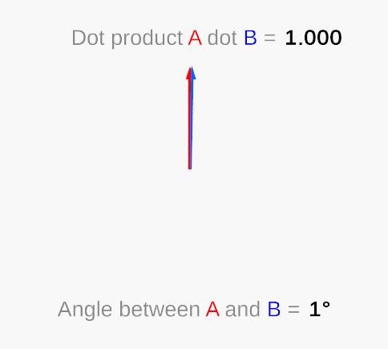]

---

## NPR Shading

.center[]


Let's Implement This! 👩🏽‍💻 🧑🏻‍💻

---

## NPR Shading II

.center[]

???

.task[ASK:]  

* What do you see?
* smooth transitions, more than one rim, no diffuse shading

--

Let's Implement This! 👩🏽‍💻 🧑🏻‍💻

???

.task[ASK:]  

* Show code file
* Live coding together, go step by step as questions
* [sphere_toon_smooth_steps](../../shader_sphere_toon_smooth/shader_sphere_toon_smooth/sphere_toon_smooth_steps.md)


---

## NPR Shading II

.center[]

This effect is based on the *Fresnel effect*.

???

.task[COMMENT:]  

* The internet uses the term *Fresnel effect* very loosely or wrongly.
