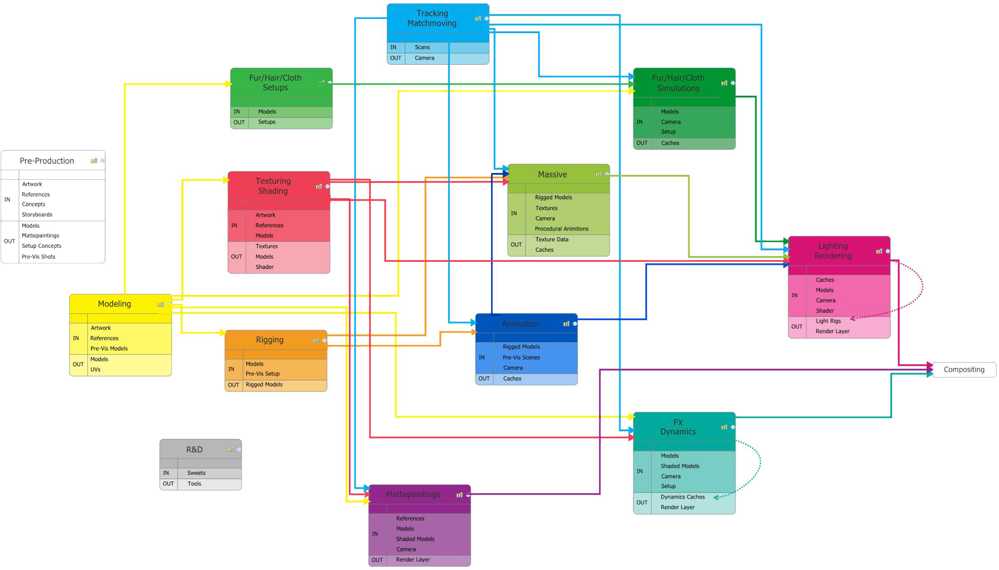
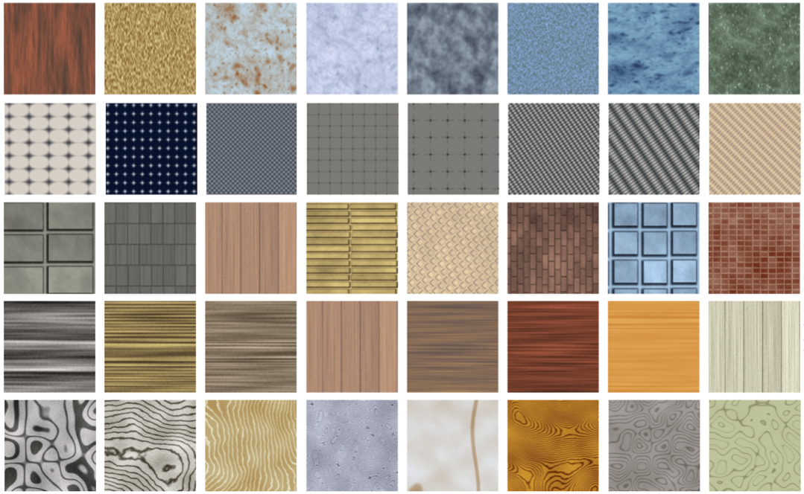

name: inverse
layout: true
class: center, middle, inverse
---

#### Prof. Dr. Lena Gieseke | l.gieseke@filmuniversitaet.de  
#### Film University Babelsberg KONRAD WOLF

# Materials and Shading Workshop

### 02 - Introduction

<!--

Start server in /doc/

h or ?: Toggle the help window
j: Jump to next slide
k: Jump to previous slide
b: Toggle blackout mode
m: Toggle mirrored mode.
c: Create a clone presentation on a new window
p: Toggle PresenterMode
f: Toggle Fullscreen
t: Reset presentation timer
<number> + <Return>: Jump to slide <number>
-->

---
template:inverse

# Introduction

---
layout: false

.header[Introduction]

## 3D Engines

We start to think about materials and shading in a *3D engine context*.

--
* A given environment such as a p5, Unity, Houdini etc. scene

--
* Assets such geometry, lights and materials already exists

--
* We need to access the given assets in the fragment shader

--
* The engine does the rendering!

???
.task[COMMENT:]  
This means we plug our shading development into a given environment such as p5, Unity, Houdini etc. and work with given assets such lights or material properties.

--

For example, a p5 scene is straight-forward to use with almost no overhead and it even gives reasonable errors for a shader.

--

> 3D engines are a good option for complex scenes and realistic appearance.

---
.header[Introduction]

## Scene Setup in the Fragment Shader

In contrast to this stands modern fragment shader development with aims to do build the whole scene within the fragments shader itself, including the rendering. 

--

However options are still limited in comparison to working within a 3D software.

???

* https://www.shadertoy.com/view/WsSBzh
* https://www.youtube.com/watch?v=8--5LwHRhjk
* Comment on youtube: "I googled how to feel stupid and this video showed up."

--

> Fragment shaders are a good option for abstracted and simplified scenes based on procedural generation principles and whenever performance is crucial (e.g. in a performance scenario).

---
template:inverse

## 3D Engine Environment

???

I want to start with giving you a bit of context.

---
.header[3D Engine Environment]

## Anatomy of a 3D Rendering

.center[]

???

Pipeline as it was used at Scanline VFX. Pipeline can vary a lot, depending on the production house.

.task[TASK:] Explain the steps

---
.header[3D Engine Environment]

## Materials & Shading

.center[]

???

.task[TASK:] What else do we need? What can not be detached from shading?

---
.header[3D Engine Environment]

## Materials & Shading

.center[]

---
.header[3D Engine Environment]

## Materials & Shading

.center[]

---
.header[3D Engine Environment]

## Materials & Shading

.center[]

???

Here an example, which demonstrates that materials and light are essential for the perception of 3D space.

---
.header[3D Engine Environment]

## Materials & Shading

.center[[[Gereon Zwosta]](http://www.gereon-zwosta.de)]

---
.header[3D Engine Environment]

## Materials & Shading

.center[[[Gereon Zwosta]](http://www.gereon-zwosta.de)]

---
.header[3D Engine Environment]

## Materials & Shading

In the context of creating a certain look for a model, e.g. to make it seamlessly fit into environment, we need to consider

--

* Texturing
* Shading
* Lighting
* Rendering

--

*On a Side Note:* Materials are often considered as the combination of textures and shading properties.

--

### Materials = Textures + Shading

---
.header[3D Engine Environment]

## Texturing

???

.task[TASK:] Means what?

--

 [[pluralsight]](https://www.pluralsight.com/courses/3ds-max-uv-mapping-fundamentals)

???

*Texturing* is usually understood as attaching an image to a shape or a geometry and the *textures* are the images we “stick” on geometry. 

*UV Maps* define a relationship between the space of the geometry and the texture space. You can also imagine this as taking the geometry and flatting it onto a 2D representation, as for example sewing pattern do.

---
.header[3D Engine Environment | Texturing]

## Procedural Texturing

A procedural texture is a texture created using a mathematical description (i.e. an algorithm) rather than directly stored data. 

???

.task[TASK:]What are the advantages to this?

--

* Low storage cost
* Unlimited texture resolution 
* Easy texture mapping

???
.task[COMMENT:]  

* The advantage of this approach is low storage cost, unlimited texture resolution and easy texture mapping.

---
.header[3D Engine Environment | Texturing]

## Procedural Texturing

These kinds of textures are often used for 

* High frequency detail, e.g. of natural elements
    * Wood, marble, granite, metal, stone, and others
* Regular patterns

---
.header[3D Engine Environment | Texturing]

## Procedural Texturing

.center[]

---
.header[3D Engine Environment | Texturing]

## Textures For Shading

Textures are also still used for shading and lighting related effects. 

???
.task[COMMENT:]  

* They enable the simulation of near-photorealism in real time by vastly reducing the number of polygons and lighting calculations needed to construct a realistic and functional 3D scene.

--

Such as 

* height mapping, 
* bump and displacement mapping, 
* reflection, specular and occlusion mapping.

.footnote[[[Wikipedia - Texture Mapping]](https://en.wikipedia.org/wiki/Texture_mapping)]

???
.task[COMMENT:]  

* Bump_01: https://www.pinterest.com/pin/513832638715552263/
* Bump_02: http://yullenpyon.blogspot.com/2014/04/mapping.html

--

These maps are usually put together and controlled by a *materials system* of the rendering enging, such as Unity.

???

.task[TASK:] What are displacement and bump maps?

Displacement

* Adds actual new geometry at render time
* The renderer subdivides the existing geometry and moves it according to the noise values

Normal and Bump Map

* Usually part of the shader
* Create the appearance of additional surface detail by changing normals at render time, without actually creating additional geometry
* This makes them faster and use less memory

.task[TASK:] Show: [What are the different texture maps for?](https://help.poliigon.com/en/articles/1712652-what-are-the-different-texture-maps-for)

--

> We will not work with procedural textures and texture maps in this workshop. 

???

.task[TASK:]What else do we need for this to work, when we have an image as texture and a geometry?

There are several tutorials and tools online. One common approach is [texture baking](https://blenderartists.org/t/what-is-texture-baking/408872), for example.

---
template:inverse

# Shading

---

## Shading

???

.task[TASK:] What would shading be in traditional drawing?

--

.center[[[Nitram]](https://nitramcharcoal.com/basic-shading-techniques/)]

--

Shading used in drawing means 

--
* to apply varying level of darkness,  

--
* to support the perception of depth, and

--
* to visualize material properties.

---

## Shading

In computer graphics, shading does pretty much the same thing:   

> A color (e.g. from a texture) is altered by varying levels of darkness (and colors). 

--

.center[]

???

White multiplied with various shades of gray.

---

## Shading

In computer graphics, shading does pretty much the same thing:   

> A color (e.g. from a texture) is altered by varying levels of darkness (and colors). 

.center[]

???

White multiplied with various shades of gray.

--

This is done based on characteristics such as

--
* the surface's angle and distance to lights

--
* light properties, and

--
* material properties.

???

On each of which we are going to have a look on now.

