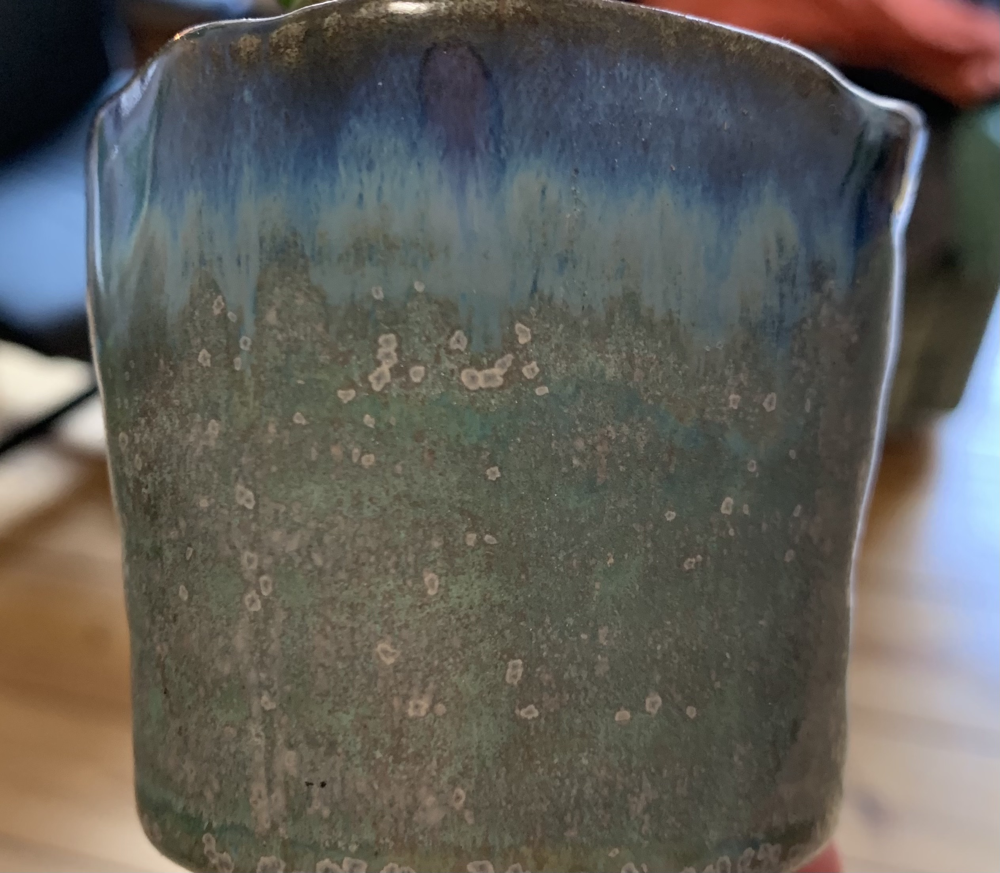

1. 

2. 

3. 

4. 

5. 

6. 

7. 

8. 

9. 
- very reflective at the top
- less reflective at the lower part
- higlights distorted by shape
- direct light source necessary for strong highlights

10. 
- very reflective
- clear highlights
- changes a lot with change in surrounding light
- looks less reflective when self illuminated
